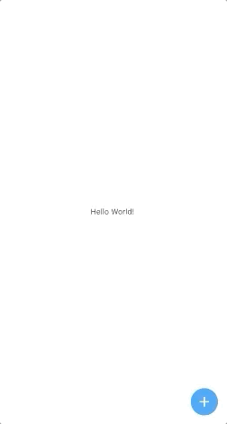

# animated_fab_menu

Simple animated floating action button that transform to menu (or any other widget)



## Getting Started

```
    Scaffold(
      appBar: AppBar(
        title: Text('TestView'),
        centerTitle: true,
      ),
      body: SafeArea(
          child: Stack(
        children: [
          Center(
            child: Text('Hello World!'),
          ),
          AddFab(
            color: Colors.red,                          //optional
            colorTo: Colors.white,                      //optional
            expandHeight: 400,                          //optional
            expandWidth: 150,                           //optional
            btnSize: 70,                                //optional
            icon: Icon(                                 //required
              Icons.add,
              color: Colors.white,
              size: 40,
            ),
            menu: Container(                            //required
              padding: EdgeInsets.symmetric(vertical: 20),
              decoration: BoxDecoration(
                color: Colors.white,
                borderRadius: BorderRadius.circular(20),
              ),
              child: ListView.builder(
                itemCount: 6,
                itemBuilder: (context, i) => Container(
                  padding: EdgeInsets.symmetric(vertical: 5),
                  alignment: Alignment.center,
                  width: double.infinity,
                  decoration: BoxDecoration(color: Colors.white),
                  child: Text(
                    '$i',
                    style: TextStyle(fontSize: 25),
                  ),
                ),
              ),
            ),
          ),
        ],
      )),
    );
```
